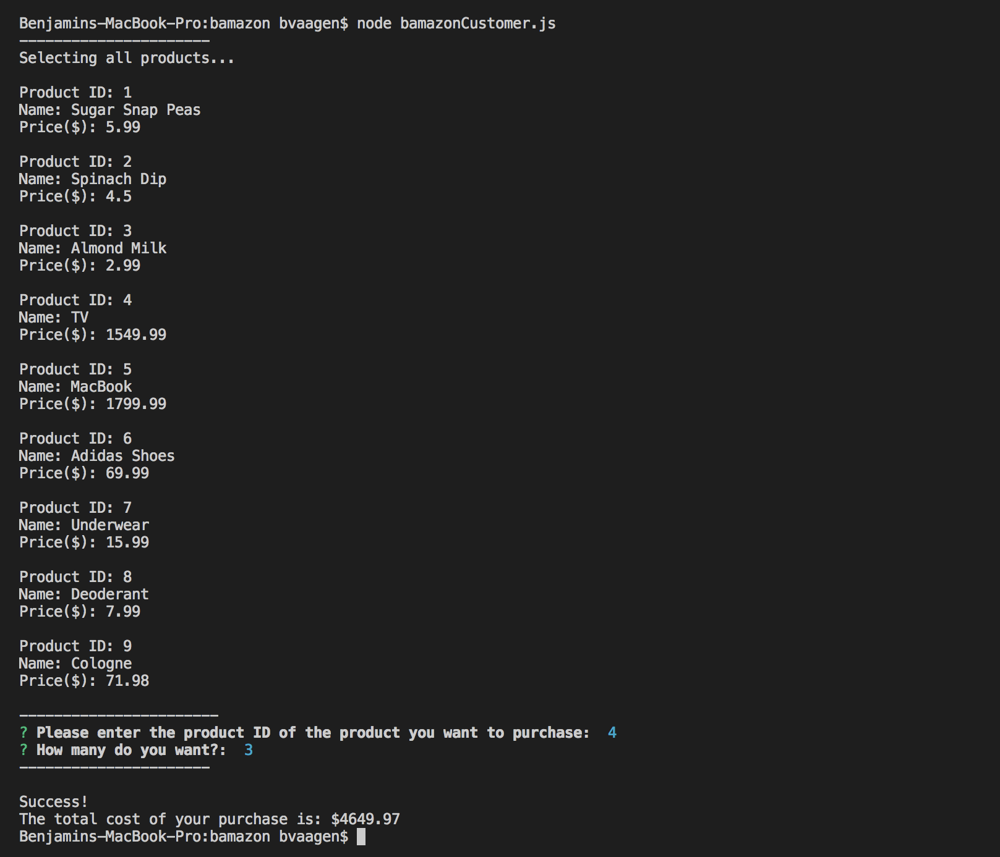
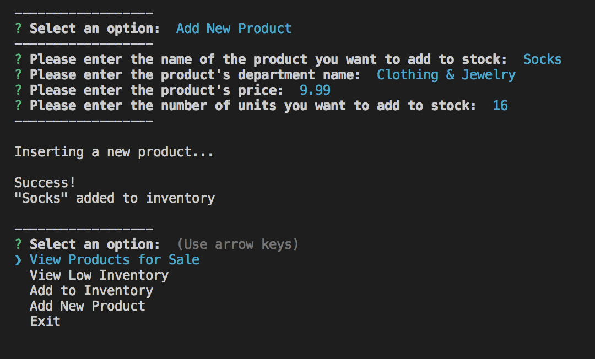
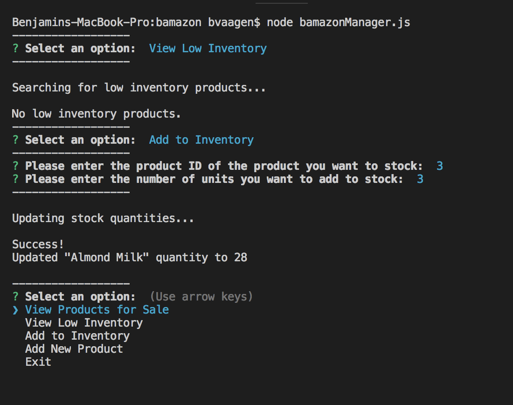

# bamazon

In this activity, I was required to create an Amazon-esque storefront using MySQL and node.js.  The customer is asked to which item they want to order by the id number, then how many of that item they want. It then gives them the total amount of their order, and deducts the number of items in inventory.

 The manager app allows you to view low inventory, add to the inventory, and add new products using inquirer. After one of these functions are performed, the database is updated.

 
 

Shout out to James Roth and his YouTube Bamazon Tutorial:
https://www.youtube.com/watch?v=lMBhC77H94U